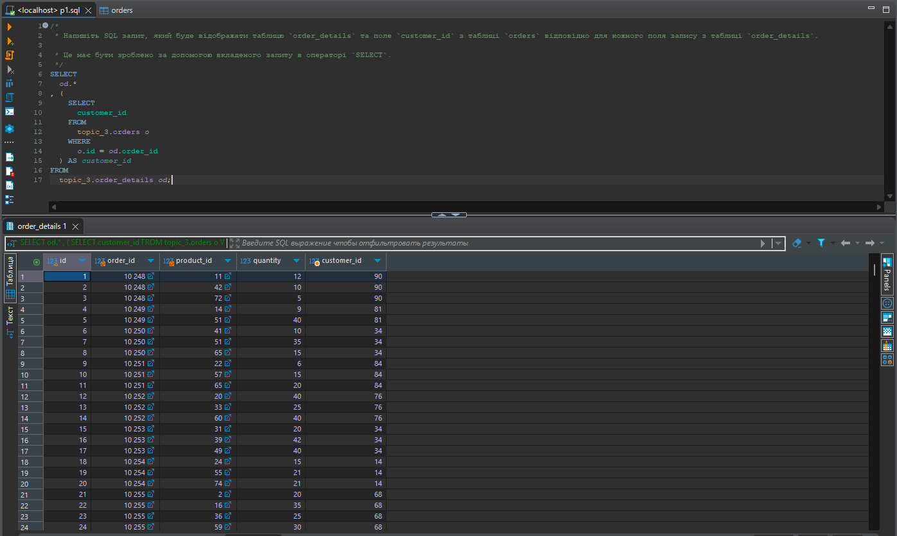
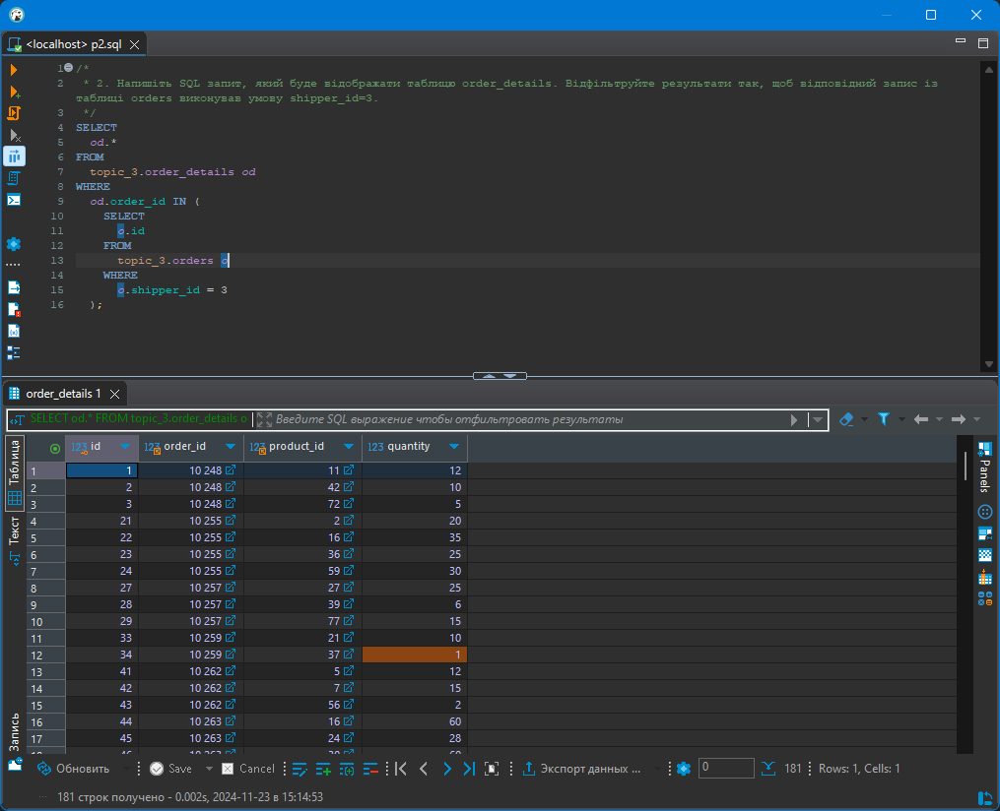
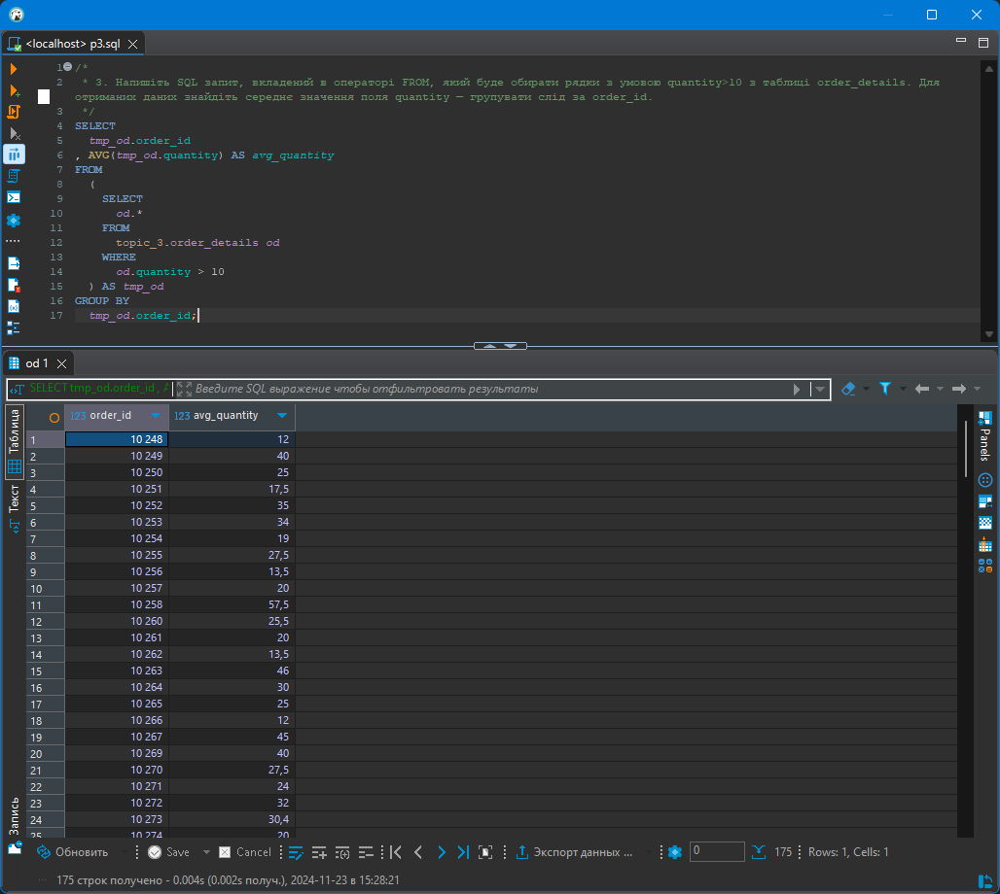
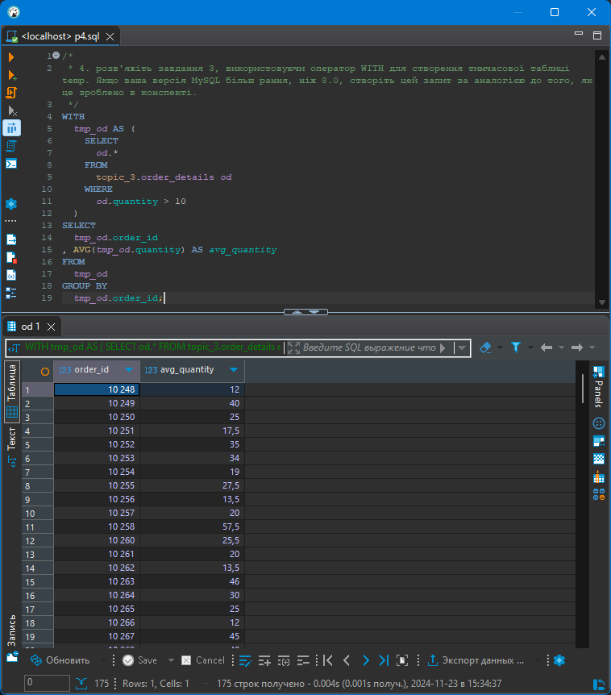
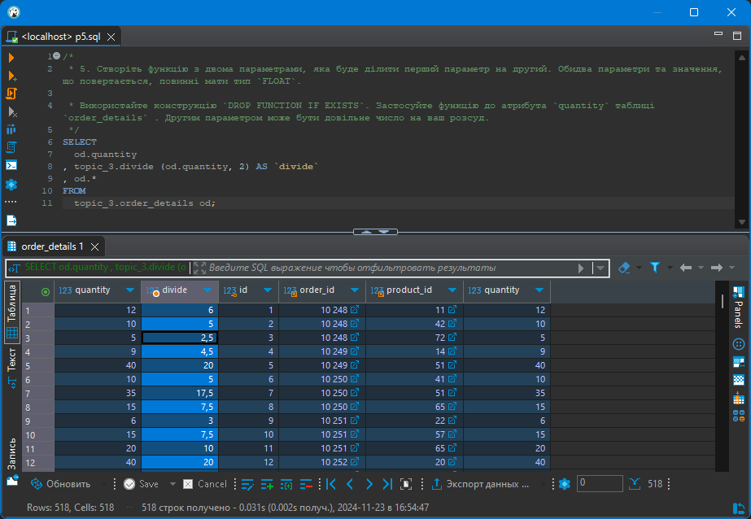

# goit-rdb-hw-05 Вкладені запити. Повторне використання коду

## Завдання 1

1\. Напишіть SQL запит, який буде відображати таблицю `order_details` та поле `customer_id` з таблиці `orders` відповідно для кожного поля запису з таблиці `order_details`.

Це має бути зроблено за допомогою вкладеного запиту в операторі `SELECT`.

---

### Рішення 1

SQL-код: [p1.sql](p1.sql)

Скрін результату



## Завдання 2

2\. Напишіть SQL запит, який буде відображати таблицю `order_details`. Відфільтруйте результати так, щоб відповідний запис із таблиці `orders` виконував умову `shipper_id=3`.

Це має бути зроблено за допомогою вкладеного запиту в операторі `WHERE`.

---

### Рішення 2

SQL-код: [p2.sql](p2.sql)

Скрін результату



## Завдання 3

3\. Напишіть SQL запит, вкладений в операторі `FROM`, який буде обирати рядки з умовою `quantity>10` з таблиці `order_details`. Для отриманих даних знайдіть середнє значення поля `quantity` — групувати слід за `order_id`.

---

### Рішення 3

SQL-код: [p3.sql](p3.sql)

Скрін результату



## Завдання 4

4.\ розв'яжіть завдання 3, використовуючи оператор `WITH` для створення тимчасової таблиці `temp`. Якщо ваша версія MySQL більш рання, ніж 8.0, створіть цей запит за аналогією до того, як це зроблено в конспекті.

---

### Рішення 4

SQL-код: [p4.sql](p4.sql)

Скрін результату



## Завдання 5

5\. Створіть функцію з двома параметрами, яка буде ділити перший параметр на другий. Обидва параметри та значення, що повертається, повинні мати тип `FLOAT`.
Використайте конструкцію `DROP FUNCTION IF EXISTS`.

Застосуйте функцію до атрибута `quantity` таблиці `order_details` . Другим параметром може бути довільне число на ваш розсуд.

### Рішення 5

Код створення функції divide

```SQL
DROP FUNCTION IF EXISTS topic_3.`divide`;
DELIMITER //
CREATE FUNCTION topic_3.`divide`(a FLOAT, b FLOAT) RETURNS float
    NO SQL
    DETERMINISTIC
BEGIN
  DECLARE res FLOAT;
  SET res = a / b;
  RETURN res;
END//
DELIMITER ;

```

SQL-код: [p5.sql](p5.sql)

Скрін результату


